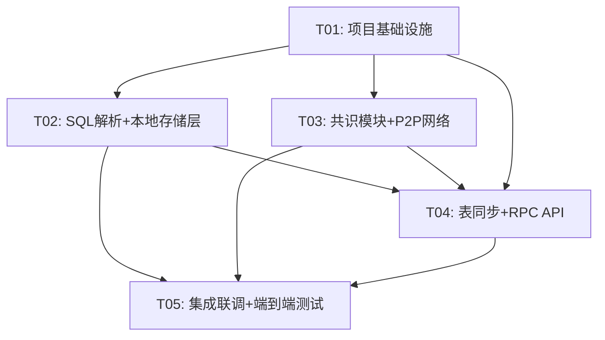

# ChainDB 系统架构设计文档

## Part A: 系统设计

---

### 1. 实现方案 + 框架选型

#### 1.1 整体架构分层

ChainDB 采用 **五层架构** 设计，核心理念为"日志即数据"：

```
┌─────────────────────────────────────────────┐
│              RPC API 层                      │  JSON-RPC 对外接口
├─────────────────────────────────────────────┤
│           业务逻辑层                         │  SQL 解析、交易构建、查询路由
├─────────────────────────────────────────────┤
│           共识层 (POP)                       │  交易集共识 + 区块共识
├─────────────────────────────────────────────┤
│           区块链层                           │  区块存储、账本管理、状态树
├─────────────────────────────────────────────┤
│           存储层                             │  本地数据库 + 表同步模块
└─────────────────────────────────────────────┘
```

**数据流**：
- **写入流**：RPC → SQL 解析 → 交易构建 → 共识 → 上链 → 表同步 → 本地DB
- **读取流**：RPC → 本地DB 即时查询（SELECT 不上链）

#### 1.2 技术选型说明

| 组件 | 选型 | 理由 |
|------|------|------|
| Web 框架 | **FastAPI** | 原生 async、自动 OpenAPI 文档、高性能 |
| ORM | **SQLAlchemy 2.0+ (async)** | 成熟稳定、支持 SQLite/MySQL 切换、异步支持 |
| 异步运行时 | **asyncio** | Python 原生异步，节点间网络通信必需 |
| 本地数据库 | **SQLite (aiosqlite)** | MVP 零依赖、单文件、后续可平滑迁移 MySQL |
| 网络通信 | **自研 P2P (asyncio + tcp)** | MVP 节点数少，无需引入复杂 P2P 库 |
| JSON-RPC | **fastapi + 自定义路由** | 轻量，符合 ChainSQL 原始接口风格 |
| SQL 解析 | **sqlparse + 自定义解析器** | 轻量级解析，满足 SQL-92 子集需求 |
| 哈希/加密 | **hashlib (Python 标准库)** | SHA-256 用于区块哈希、Merkle Tree |
| 序列化 | **msgpack** | 比 JSON 更紧凑高效，适合网络传输 |
| 日志 | **loguru** | 比 logging 更易用，结构化日志 |

#### 1.3 关键设计决策

1. **区块链即 WAL**：区块按序号递增，每个区块包含一组交易（SQL 语句），相当于 WAL 日志段。节点重启后从链上回放即可恢复状态。

2. **三种交易类型扁平化**：sqlStatement / tableListSet / sqlTransaction 统一为 Transaction 的不同 `tx_type`，避免继承爆炸。

3. **POP 共识两阶段**：
   - 阶段1（交易集共识）：Leader 从 mempool 选交易打包提案 → 广播 → 投票 → 超过 2/3 确认
   - 阶段2（区块共识）：验证交易集 → 计算状态根哈希 → 投票 → 出块

4. **表同步异步执行**：表同步模块监听新区块事件，异步回放交易到本地数据库，不阻塞共识流程。

5. **SELECT 不上链**：查询操作直接读取本地数据库，无需经过共识，保证查询性能。

6. **单链串行**：MVP 采用单链串行提交，天然 Serializable 隔离级别，sqlTransaction 原子性由单链顺序保证。

---

### 2. 文件列表及相对路径

```
chain_db/
├── pyproject.toml                    # 项目配置 + 依赖声明
├── README.md                         # 项目说明
├── docs/
│   ├── system_design.md              # 本文档
│   ├── sequence-diagram.mermaid      # 时序图
│   └── class-diagram.mermaid         # 类图
├── src/
│   └── chain_db/
│       ├── __init__.py               # 包初始化，版本号
│       ├── config.py                 # 全局配置（节点、网络、共识参数）
│       ├── main.py                   # 入口文件：启动节点 + FastAPI
│       ├── models/
│       │   ├── __init__.py
│       │   ├── transaction.py        # Transaction 数据模型 + 序列化
│       │   ├── block.py              # Block 数据模型 + 哈希计算
│       │   └── ledger.py             # Ledger 账本管理（区块索引、状态树）
│       ├── sql/
│       │   ├── __init__.py
│       │   ├── parser.py             # SQL 解析器（INSERT/UPDATE/DELETE/CREATE/ALTER/DROP）
│       │   ├── validator.py          # SQL 语义校验（表存在性、字段匹配）
│       │   └── converter.py          # SQL → Transaction 转换器
│       ├── consensus/
│       │   ├── __init__.py
│       │   ├── pop.py                # POP 共识主逻辑（两阶段）
│       │   ├── proposal.py           # Leader 提案构建
│       │   └── vote.py               # 投票收集与统计
│       ├── network/
│       │   ├── __init__.py
│       │   ├── p2p.py                # P2P 网络层（节点发现、消息广播）
│       │   ├── protocol.py           # 通信协议定义（消息类型、编解码）
│       │   └── router.py             # 消息路由（分发到共识/同步模块）
│       ├── sync/
│       │   ├── __init__.py
│       │   ├── table_sync.py         # 表同步模块（回放交易到本地DB）
│       │   └── state_manager.py      # 状态管理（跟踪同步进度）
│       ├── storage/
│       │   ├── __init__.py
│       │   ├── database.py           # 本地数据库管理（SQLAlchemy 引擎、会话）
│       │   ├── table_registry.py     # 表注册中心（元信息管理）
│       │   └── query.py             # 查询执行器（SELECT 执行）
│       └── api/
│           ├── __init__.py
│           ├── rpc.py                # JSON-RPC 路由与请求处理
│           └── handlers.py           # RPC 方法实现（sql_submit, query 等）
├── tests/
│   ├── __init__.py
│   ├── test_transaction.py
│   ├── test_block.py
│   ├── test_sql_parser.py
│   ├── test_consensus.py
│   ├── test_table_sync.py
│   └── test_rpc.py
└── scripts/
    └── start_node.py                 # 节点启动脚本
```

---

### 3. 数据结构和接口（类图）

详见 `docs/class-diagram.mermaid`，核心关系概述：

- **Transaction** 是核心数据单元，携带 tx_type（SQL_STATEMENT / TABLE_LIST_SET / SQL_TRANSACTION）、raw_sql、payload 等
- **Block** 包含多个 Transaction，维护 prev_hash / tx_root / state_root 三棵树根
- **Ledger** 管理区块链，提供按区块号/交易哈希查询，计算全局状态根
- **Mempool** 管理待确认交易，提供增删查清操作
- **POPConsensus** 是共识引擎，协调 Proposal / Vote 的两阶段流程，依赖 Mempool / Ledger / P2PNetwork
- **TableSync** 监听新区块，回放交易到本地 Database，维护 StateManager 同步进度
- **SQLParser / SQLValidator / SQLConverter** 三段式处理 SQL 提交
- **RPCHandler** 是对外接口层，聚合 SQLConverter / Mempool / QueryExecutor / Ledger

---

### 4. 程序调用流程（时序图）

详见 `docs/sequence-diagram.mermaid`，三个核心流程：

#### 4.1 SQL 提交上链流程
Client → RPCHandler → SQLConverter(Parsers+Validator) → Mempool → (共识) → Ledger → TableSync → Database

#### 4.2 共识流程（详细）
Leader 提案 → 广播 → 投票（交易集共识）→ 构建区块 → 投票（区块共识）→ 出块

#### 4.3 表同步流程
启动检查同步状态 → 逐区块回放 → 区分 DDL/DML/事务分别处理 → 更新同步进度

---

## Part B: 任务分解

---

### 5. 依赖包列表

| 包 | 版本 | 用途 |
|---|---|---|
| fastapi | ^0.110.0 | Web 框架，提供 HTTP + JSON-RPC |
| uvicorn | ^0.29.0 | ASGI 服务器 |
| sqlalchemy | ^2.0.0 | ORM + 异步数据库访问 |
| aiosqlite | ^0.20.0 | SQLite 异步驱动 |
| pydantic | ^2.6.0 | 数据模型验证（FastAPI 内置依赖） |
| sqlparse | ^0.5.0 | SQL 语句解析 |
| msgpack | ^1.0.0 | 高效二进制序列化 |
| loguru | ^0.7.0 | 结构化日志 |
| pytest | ^8.0.0 | 测试框架 |
| pytest-asyncio | ^0.23.0 | 异步测试支持 |
| httpx | ^0.27.0 | 异步 HTTP 客户端（测试用） |

---

### 6. 任务列表（按实现顺序）

#### T01: 项目基础设施

**描述**：搭建项目骨架，包括依赖管理、配置系统、应用入口、核心数据模型定义。

**涉及文件**（7 个核心文件 + 3 个包初始化）：
- `pyproject.toml` — 项目元数据 + 全部依赖声明
- `src/chain_db/__init__.py` — 包初始化，版本号 `__version__`
- `src/chain_db/config.py` — NodeConfig 数据类 + 默认配置加载（从环境变量/yaml）
- `src/chain_db/main.py` — 入口：创建 FastAPI app，注入各模块实例，启动 uvicorn + P2P
- `src/chain_db/models/__init__.py`
- `src/chain_db/models/transaction.py` — Transaction 数据模型（Pydantic），TxType 枚举，hash 计算，序列化/反序列化
- `src/chain_db/models/block.py` — Block 数据模型（Pydantic），hash/tx_root 计算，创世区块生成
- `src/chain_db/models/ledger.py` — Ledger 类（内存区块索引，get_block, get_transaction, append_block, compute_state_root）
- `scripts/start_node.py` — CLI 启动脚本（读取配置，调用 main）
- `tests/test_transaction.py` — Transaction 序列化/哈希测试
- `tests/test_block.py` — Block 构建/哈希/创世区块测试

**依赖**：无

**优先级**：P0

**验收标准**：
- `pip install -e .` 成功
- `python -m chain_db.main` 可启动空节点（无 P2P 无共识，仅 FastAPI health check）
- Transaction 序列化 → 反序列化 roundtrip 一致
- Block hash 计算可复现，创世区块可生成
- Ledger 可 append_block / get_block / get_transaction

---

#### T02: SQL 解析 + 本地存储层

**描述**：实现 SQL 解析器（SQL-92 核心子集）、语义校验、交易转换器；实现本地数据库管理、表注册中心、查询执行器。这一层是"业务逻辑层"和"存储层"的完整实现。

**涉及文件**（9 个源码 + 1 个测试）：
- `src/chain_db/sql/__init__.py`
- `src/chain_db/sql/parser.py` — SQLParser：解析 INSERT/UPDATE/DELETE/CREATE TABLE/ALTER TABLE/DROP TABLE，输出 ParsedSQL（含 sql_type, table_name, data, where_clause）
- `src/chain_db/sql/validator.py` — SQLValidator：校验表存在性（INSERT/UPDATE/DELETE）、字段匹配、CREATE 不重名
- `src/chain_db/sql/converter.py` — SQLConverter：将 SQL + account → Transaction（单条 or sqlTransaction 批量）
- `src/chain_db/storage/__init__.py`
- `src/chain_db/storage/database.py` — Database 类：SQLAlchemy async engine 初始化，execute_raw(sql) 执行 DDL/DML，事务控制（begin/commit/rollback）
- `src/chain_db/storage/table_registry.py` — TableRegistry + TableMeta + ColumnDef：表元信息管理，register/unregister/get/exists
- `src/chain_db/storage/query.py` — QueryExecutor + QueryResult：SELECT 执行，返回 {columns, rows, row_count}
- `tests/test_sql_parser.py` — 各类 SQL 解析测试 + 校验测试 + 转换测试

**依赖**：T01（Transaction/Block 模型）

**优先级**：P0

**验收标准**：
- SQLParser 正确解析 6 种 SQL 类型，输出结构化 ParsedSQL
- SQLValidator 对不存在的表 INSERT 报错，对重名 CREATE 报错
- SQLConverter 将 SQL 转为正确 tx_type 的 Transaction
- Database 可 execute_raw DDL 创建表 + DML 插入/更新/删除数据
- QueryExecutor 执行 SELECT 返回正确 QueryResult
- TableRegistry 正确管理表元信息

---

#### T03: 共识模块 + P2P 网络

**描述**：实现 POP 共识引擎（两阶段：交易集共识 + 区块共识）、Leader 提案构建、投票收集统计；实现 P2P 网络层（TCP 连接管理、消息广播、协议编解码、消息路由）。

**涉及文件**（7 个源码 + 1 个测试）：
- `src/chain_db/consensus/__init__.py`
- `src/chain_db/consensus/pop.py` — POPConsensus：两阶段状态机（IDLE → PROPOSING → TXSET_VOTING → BLOCK_VOTING → COMMITTING），定时触发共识，处理 proposal/vote 消息，出块后写入 Ledger
- `src/chain_db/consensus/proposal.py` — Proposal 数据模型 + Leader 提案构建逻辑（从 Mempool 选交易）
- `src/chain_db/consensus/vote.py` — Vote 数据模型 + 投票收集器（统计赞成/反对，判断是否达 2/3+1）
- `src/chain_db/network/__init__.py`
- `src/chain_db/network/p2p.py` — P2PNetwork：asyncio TCP server/client，节点连接管理，broadcast/send_to
- `src/chain_db/network/protocol.py` — Message 数据模型 + MsgType 枚举 + msgpack 编解码
- `src/chain_db/network/router.py` — 消息路由：根据 msg_type 分发到 consensus / sync 模块
- `tests/test_consensus.py` — 单节点共识流程测试（模拟 proposal/vote），多节点共识集成测试

**依赖**：T01（Transaction/Block/Ledger 模型）

**优先级**：P0

**验收标准**：
- POPConsensus 状态机正确转换
- Leader 正确从 Mempool 构建提案
- 投票达 2/3+1 后正确进入下一阶段
- 两阶段共识完成后正确出块并写入 Ledger
- P2PNetwork 可建立 TCP 连接，broadcast 消息可达所有 peer
- 消息编解码 roundtrip 一致
- Router 正确将 PROPOSAL/VOTE 路由到 consensus

---

#### T04: 表同步 + RPC API

**描述**：实现表同步模块（监听新区块、回放交易到本地数据库、DDL/DML/事务分别处理）；实现 JSON-RPC API 层（sql_submit、sql_query、tx_query、block_query）。

**涉及文件**（7 个源码 + 1 个测试）：
- `src/chain_db/sync/__init__.py`
- `src/chain_db/sync/table_sync.py` — TableSync：监听 Ledger 新区块事件（asyncio Event/回调），逐交易回放：DDL→Database+TableRegistry，DML→Database，事务→批量执行+原子性保证
- `src/chain_db/sync/state_manager.py` — StateManager：跟踪 synced_height、table_versions，持久化同步进度到本地文件
- `src/chain_db/api/__init__.py`
- `src/chain_db/api/rpc.py` — JSON-RPC 路由：统一入口 `/rpc`，解析 method + params，转发到 handlers
- `src/chain_db/api/handlers.py` — RPCHandler：sql_submit（SQL→Transaction→Mempool）、sql_query（SELECT→QueryExecutor）、tx_query（按哈希查 Ledger）、block_query（按号查 Ledger）
- `tests/test_table_sync.py` — 同步回放测试（DDL+DML+事务），断点续传测试
- `tests/test_rpc.py` — RPC 接口测试（httpx 异步客户端）

**依赖**：T01 + T02 + T03（需要全部核心模块）

**优先级**：P0

**验收标准**：
- TableSync 正确回放 DDL（创建表+注册）、DML（插入/更新/删除）、事务（批量执行或回滚）
- StateManager 正确跟踪同步进度，重启后可从断点续传
- JSON-RPC sql_submit 返回 tx_hash 和 queued 状态
- JSON-RPC sql_query 正确执行 SELECT 并返回 QueryResult
- JSON-RPC tx_query / block_query 正确查询链上数据
- 所有 RPC 响应遵循 {code, data, message} 格式

---

#### T05: 集成联调 + 端到端测试

**描述**：将所有模块集成到 main.py，实现完整启动流程；编写端到端测试（3 节点组网 → SQL 提交 → 共识出块 → 表同步 → 查询验证）；修复集成问题。

**涉及文件**（3 个文件修改 + 1 个新测试）：
- `src/chain_db/main.py` — 完善：实例化所有模块，注入依赖，启动 P2P + 共识 + 表同步 + FastAPI
- `src/chain_db/config.py` — 完善：多节点配置模板（node_1.yaml, node_2.yaml, node_3.yaml）
- `scripts/start_node.py` — 完善：支持 --config 指定配置文件，--genesis 创世区块初始化
- `tests/test_e2e.py` — 端到端测试：启动3节点 → CREATE TABLE → INSERT → SELECT验证 → UPDATE → SELECT验证 → 多交易出块 → 按区块号/交易哈希查询

**依赖**：T01 + T02 + T03 + T04（需要所有模块完成）

**优先级**：P0

**验收标准**：
- 3 节点可正常启动并通过 P2P 互联
- SQL 提交后经过共识出块，所有节点表同步一致
- SELECT 查询返回正确数据
- sqlTransaction 原子性验证（部分失败整组回滚）
- 区块查询和交易查询正确返回
- 节点重启后可从链上回放恢复状态

---

### 7. 任务依赖图



**说明**：
- T01 是基础，T02 和 T03 可并行开发（都只依赖 T01 的数据模型）
- T04 依赖 T02（SQL/存储）和 T03（共识/网络），是串行汇聚点
- T05 是最终集成，依赖所有前置任务

---

### 8. 共享知识（跨文件约定）

```
# 编码规范
- Python 3.11+，使用 type hints
- 异步优先：所有 I/O 操作使用 async/await
- 文件编码：UTF-8
- 行宽限制：120 字符

# 命名约定
- 类名：PascalCase（如 POPConsensus, TableSync）
- 函数/方法：snake_case（如 compute_hash, append_block）
- 常量：UPPER_SNAKE_CASE（如 BLOCK_INTERVAL, CONSENSUS_TIMEOUT）
- 私有方法：_前缀（如 _validate_internal）
- 配置项：小写 + 点分隔（如 consensus.timeout, network.port）

# 数据格式约定
- 所有哈希使用 SHA-256，输出为 hex 字符串（64字符）
- 时间戳使用 Unix 时间戳（整数，秒级）
- 交易哈希 = SHA-256(tx_type + account + sequence + payload_json + raw_sql)
- 区块哈希 = SHA-256(block_number + prev_hash + tx_root + state_root + timestamp)
- 所有 API 响应格式：{code: int, data: Any, message: str}
  - code=0 表示成功，非0表示错误
  - 常见错误码：1=参数错误, 2=SQL解析失败, 3=校验失败, 4=共识超时, 5=内部错误

# 日志规范
- 使用 loguru，格式：{time:YYYY-MM-DD HH:mm:ss} | {level} | {module}:{function}:{line} | {message}
- 关键操作必须记录：交易提交、共识阶段切换、区块生成、同步进度
- 敏感信息不上日志（SQL 中的值用 ? 替代）

# 错误处理策略
- 业务错误：返回标准 {code, data, message} 响应，不打断流程
- 系统错误：记录日志 + 根据严重程度决定是否中断
- 共识超时：超时后重新进入下一轮共识
- 数据库错误：事务回滚 + 日志告警

# SQL 解析约定
- MVP 支持 SQL-92 核心子集
- INSERT: INSERT INTO table (cols) VALUES (vals)
- UPDATE: UPDATE table SET col=val WHERE condition
- DELETE: DELETE FROM table WHERE condition
- CREATE TABLE: CREATE TABLE table (col_def, ...)
- DROP TABLE: DROP TABLE table
- ALTER TABLE: ALTER TABLE table ADD/DROP/MODIFY column
- WHERE 仅支持简单条件（AND 连接，=/>/</>=/<=/>=/!= 比较）
- 不支持子查询、JOIN、GROUP BY、HAVING、UNION

# 共识参数
- 出块间隔：3 秒（可配置）
- 共识超时：5 秒（可配置）
- 最少确认节点数：2/3 + 1（向下取整）
- MVP 节点数：3-5
```

---

### 9. 待明确事项

1. **Leader 选举机制**：MVP 采用静态配置（配置文件指定 leader），后续需切换为动态选举（如基于节点 ID 轮转或 VRF）
2. **节点身份与权限**：MVP 不做节点认证，任何配置了正确 peer 列表的节点可加入。后续需引入节点证书/许可机制
3. **Merkle Tree 实现范围**：MVP 使用简化版 Merkle Tree（仅交易根哈希），状态树用整体哈希替代。后续需实现完整的 Merkle Patricia Trie
4. **sqlTransaction 部分失败**：如果事务内某条 SQL 在表同步回放时失败，MVP 策略为整组回滚。但链上交易已不可逆，需后续引入补偿交易机制
5. **大结果集分页**：SELECT 返回大量数据时的分页策略，MVP 暂不实现，返回全量
6. **并发写入**：MVP 单链串行，同一时刻仅 leader 可出块。如果未来多链并行，需重新设计共识和状态模型
7. **数据快照**：MVP 不支持历史状态快照查询，后续可通过维护多版本状态实现
8. **C 扩展接口**：共识模块预留 `abc.ABC` 抽象基类 + 注册机制，后续可替换为 C 实现的高性能共识引擎
